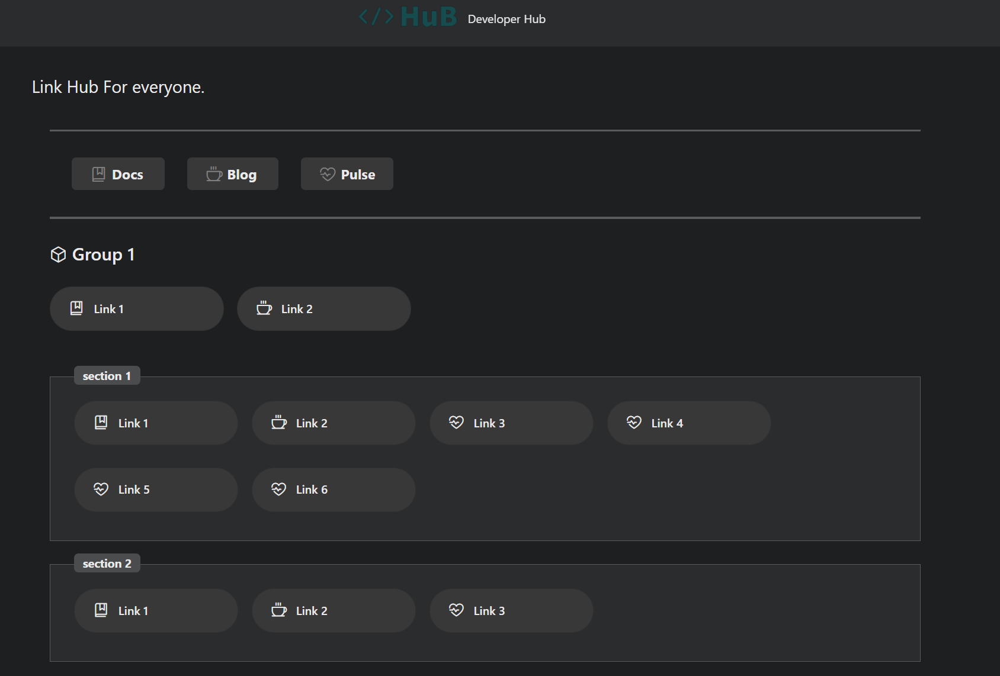

# HuB

Bookmarks organizer & landing app



## Supported Platforms

- linux_amd64/linux_arm64

## Configuration

HuB is configured via a YAML file you can provide to the container/binary. The default configuration is located at `configs/config.yaml`. The following is an example configuration:

```yaml
app:
  customHtml: <string>      # Custom HTML content
  title: <string>           # Application title
  subtitle: <string>        # Application subtitle
  logoUrl: <string>         # URL to the logo image
  disclaimer: <string>      # Disclaimer text
  debug: <bool>             # Debug mode (true/false)

data:
  links:                   # Array of main links
    - caption: <string>
      url: <string>
      icon: <string>
      newTab: <bool>
      links:               # Nested links
        - ...

  groups:                  # Array of groups
    - caption: <string>
      links:
        - ...
      sections:            # Array of sections within a group
        - caption: <string>
          links:
            - ...

```

