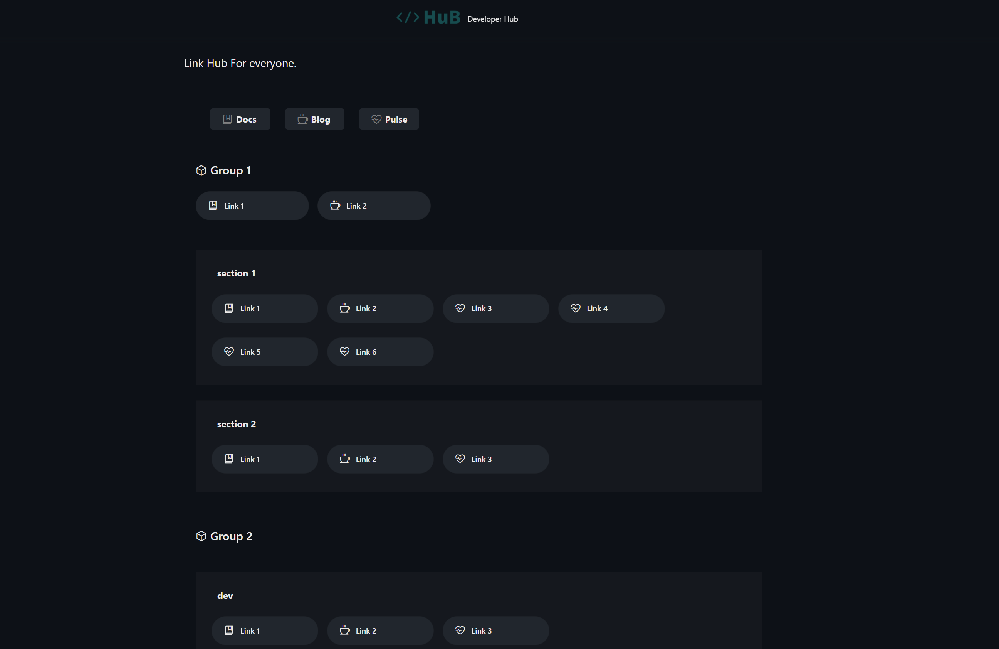

# hub

`hub` is a links & bookmarks app designed to be simple, lightweight, and easy to use. It relies on a YAML configuration file to define the links and groups. Can be deployed as a container or binary. A Helm chart is also available.

[](https://github.com/zcubbs/hub/releases)

[](https://pkg.go.dev/github.com/zcubbs/hub)
[](https://github.com/zcubbs/hub/actions/workflows/lint.yaml)
[](https://github.com/zcubbs/hub/actions/workflows/scan.yaml)

[](https://goreportcard.com/report/github.com/zcubbs/hub)
[](https://github.com/zcubbs/hub/graphs/contributors)
[](./LICENSE)



## Supported Platforms

- linux_amd64/linux_arm64

## Installation

### From Binary

You can download the latest release from [here](https://github.com/zcubbs/hub/releases)
```bash
hub -config /path/to/config.yaml
```

### Using Docker

```bash
docker run -d \
    -p 8000:8000 \
    -v /path/to/config.yaml:/app/config.yaml \
    zcubbs/hub:latest
```

### Using Helm

```bash
helm repo add hub https://zcubbs.github.io/hub
helm repo update
helm install hub hub/hub -f values.yaml
```

see [values.yaml](chart/values.yaml) for the default values.

## Configuration

HuB is configured via a YAML file you can provide to the container/binary. The example configuration is located at `examples/config.yaml`. The following is an example configuration:

```yaml
app:
  server:
    port: <int>             # Application port
  customHtml: <string>      # Custom HTML content
  title: <string>           # Application title
  subtitle: <string>        # Application subtitle
  logoUrl: <string>         # URL to the logo image
  disclaimer: <string>      # Disclaimer text
  debug: <bool>             # Debug mode (true/false)

data:
  links:                   # Array of main links
    - caption: <string>
      url: <string>
      icon: <string>
      newTab: <bool>
      links:               # Nested links
        - ...

  groups:                  # Array of groups
    - caption: <string>
      links:
        - ...
      sections:            # Array of sections within a group
        - caption: <string>
          links:
            - ...
  footer:
    links:
      - caption: <string>
        url: <string>
        icon: <string>
        newTab: <bool>
      - ...
```

